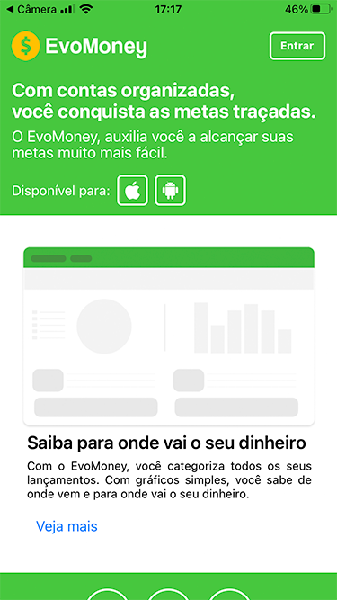

<h1>Aplicativo EvoMoney</h1>
 
<h2>Introdução</h2>
 

O EvoMoney é um aplicativo móvel desenvolvido para ajudar as pessoas a atingirem seus objetivos financeiros. Com base em informações como renda, despesas, objetivos financeiros, tempo de investimento e disposição para correr riscos, o aplicativo traça um perfil para cada usuário e oferece opções e sugestões de investimentos personalizadas. O objetivo é auxiliar cada pessoa a investir de forma mais eficiente e adequada às suas necessidades e objetivos, evitando endividamentos desnecessários e alcançando seus sonhos financeiros de forma mais fácil e planejada.

 
<h2>Descrição da aplicação</h2>

 O EvoMoney irá possuir 4 telas: Home, Login, Cadastro e a página de objetivo do usuário. Na página de objetivo, o usuário preencherá suas informações para que o aplicativo possa traçar seu perfil financeiro e apresentar as melhores opções de investimento para ele alcançar seus objetivos. As informações serão organizadas de forma clara e simples para facilitar o uso do aplicativo.

 
<h2>Imagens das Telas</h2>
 
<h3>Página Home</h3>
 

 
<h3>Página de Login</h3>
 

